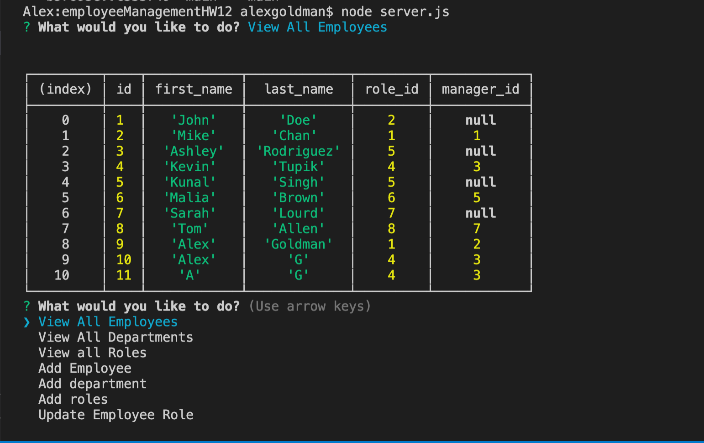

# employeeManagementHW12

## Table of Contents: 
[Project Description](#Project-Description)  
[Usage Information](#Usage-Information)   
[Questions and Contact Information](#Questions-and-Contact-Information)  
[Screenshots](#Screenshots)  
[Heroku](#Heroku)  

## Project Description 
This homework is a command line application that allows the user to access information from a MySQL database. The user can add to the database, view the current data, and alter existing data.

## Usage Information 
Please run node server.js in your terminal to begin the application

### Questions and Contact Information 
Github: github.com/Alexgoldman98  
Github username: Alexgoldman98   
Email address: alexgoldman98@gmail.com  
Any Questions should be directed to me using the above contact information.

### Screenshots

### Video
https://youtu.be/SW6rcjs4pOM